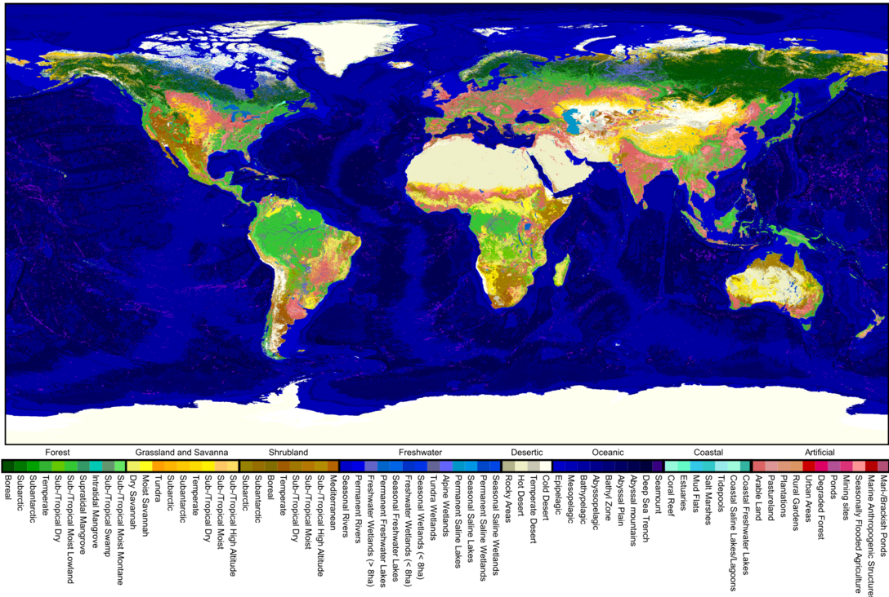

```{r setup, include=FALSE}
knitr::opts_chunk$set(echo = FALSE)
```

### Why develop this project?
<div width="80%;">
<p align='justify'>
In an era where global biodiversity is under persistent threat (XXXX) and many species have already been lost (XXXX), the work of initiatives such as the <a href="https://www.iucnredlist.org/">IUCN Red List</a> is critical. This initiative is an essential source of data on biodiversity threats, reporting on numbers and declines of individual species. Additionally, the IUCN Red List provides expert knowledge on species-habitat linkages, which we can use to anticipate threats related to changes in ecosystems extent. While this link between ecosystems and species is clear, until recently, a comprehensive database of maps was missing and, until now, no time-series datasets exist. The latter is fundamental, as the long-term monitoring of ecosystem extents show us trends in ecosystem extent change that help us anticipate new biodiversity crisis.
</p>


</div>

<aside>
  <br>
  <p>**Spatial scope**</p>
  <p>Global</p>
  <p>**Temporal scope**</p>
  <p>Multi-year Snapshot(s)</p>
  <br>
  <hr style="margin-top:0;margin-bottom:0;">
  <br>
  <p>**Documentation**</p>
  <p>Paper under review</p>
  <p>**Developed under**</p>
  <br>
  <hr style="margin-top:0;margin-bottom:0;">
  <br>
  
</aside>

### What did we do?
<p align='justify'>
We capitalize on recent progress in multi-decade environmental mapping to map the sub-pixel areas-of-occupancy of 71 terrestrial, freshwater, coastal and oceanic ecosystem types annually between 1992 and 2018 at 1-km resolution. For immediate conservation applicability, we adopt the habitat class scheme of the IUCN Red List of Threatened Species. The products are validated using species range and occurrence data, showing high overall accuracies (88% at 10-km resolution), and are accompanied by data on regional uncertainties.
</p>

### How does it compare to existing data?
<p align='justify'>
Recently, Jung et al. developed the first maps of ecosystem extent following the IUCN typology. Similarly to us, they made a substantial effort collating varied global datasets on multiple environmental variables (e.g. land cover, climate), combining them through empirical rulesets that translate ecosystem definitions into combinations of environmental drivers. While this effort is indeed commendable, it has some limitations that impair its use in the detection of threatened species. Our paper provides an in-depth comparison of our validation efforts for both products, where we show GlobES is shown to be substantially better, both locally and regionally, demonstrating a better fit to expert knowledge on ecosystem occurrences.
</p>

<hr>
**Found some mistakes?**
[Click here to edit it them in the GitHub repository](https://github.com/macroecology-society/data-catalog/tree/main/_posts/GlobES/)
<hr>
