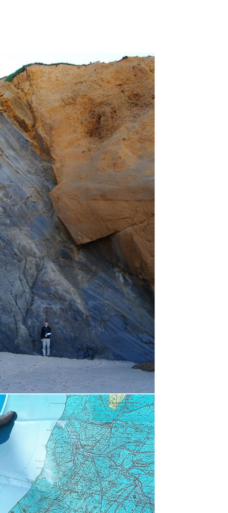

```{css, echo=FALSE}
d-title, d-byline {display: none}
```
```{r setup, include=FALSE}
knitr::opts_chunk$set(echo = TRUE)
```

<!----------------------------------------------------------------------------------------------------------------------------------------------------->

<br>
<br>

<div style="margin:0 auto;padding:0 auto;height:1000px;">

<!----------------------------------------------------------------------------------------------------------------------------------------------------->

<h3 style="border-bottom:2px solid #77C66E;margin:10;">What do I do (as a geographer)?</h3>
<p align='justify'>
As a friend once phrased, <cite>Geography is not a science, it's a philosophy</cite>. Most sciences focus on a particular component of the natural and human world, from climate to animal behavior. But Geography has no clear focus. Instead, it looks at those components as interdependent, interacting in space and time to form a larger system. With a firm eye on that complexity, geographers adopt a multidisciplinary approach to science. They push beyond the boundaries of a particular discipline, borrowing methods and concepts from multiple sciences to map complex spatial and temporal processes.
</p>
<p align='justify'>
Remaining faithful to these principles, I became a flexible scientist. My work is both multi and interdisciplinary, piecing together methods and concepts from different disciplines to answer complex research questions. In this process, I frequently integrate different types of data, such as remote sensing, animal movement, and socioeconomic statistics, all of which have their own strengths, limitations, and organizational standards. These data are often large in volume and in scale (i.e. thematic, temporal, spatial), and I routinely develop automated methods to mobilize and analyze that profit from cloud computing.
</p>

<!----------------------------------------------------------------------------------------------------------------------------------------------------->

<h3 style="border-bottom:2px solid #77C66E;margin:10;">Where have I been?</h3>
<p align="justify">
I studied Geography in Portugal, my home country. Since then, I worked in many institutions, not only in Portugal, but also in Italy and in Germany. In the map below, you see my latest stops. Click on the records to access the webpage of the respective institution. 
</p>

```{r, out.width="100%", echo=FALSE}
library(dplyr)
library(ggplot2)
library(rjson)
library(jsonlite)
library(leaflet)
library(RCurl)

places = read.csv('places.csv', stringsAsFactors=F)

leaflet() %>% 
  addTiles %>%addCircleMarkers(data=places, lng=~longitude, lat=~latitude, clusterOptions=markerClusterOptions(oomToBoundsOnClick=TRUE), 
                               popup=paste0("<a title='", places$name, "' href='", places$url, "'></a>"))

```

</div>

<aside>

</aside>
