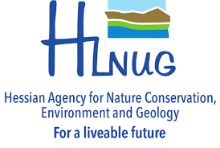

```{r setup, include=FALSE}
knitr::opts_chunk$set(echo = TRUE)
```

```{css, echo=FALSE}
d-title, d-byline {display: none}
```

<!----------------------------------------------------------------------------------------------------------------------------------------------------->
<!----------------------------------------------------------------------------------------------------------------------------------------------------->

<h3 style="border-bottom:2px solid #77C66E;margin:10;width:80vh;">Professional experience</h3>

<!----------------------------------------------------------------------------------------------------------------------------------------------------->

<h4 style="border-bottom:1px solid lightgrey;">German Center for Integrative Biodiversity Research (iDiv)</h4>
<article>

<ul style="font-size:80%;">
<li><i>Student counseling (e.g. PhD method, analytical concepts)</i>
<li><i>Multidisciplinary (e.g. Ecology, Agriculture)</i>
<li><i>Big data integration (remote sensing, species observations)</i>
</ul>
</article>

<aside style="float:right;border-left:1px solid lightgrey;padding:10px;">
<h5 style="margin:0 auto;">time period</h5>
*2019 - present*
<h5 style="margin:0 auto;">Location</h5>
*University Leipzig, Germany*
</aside>

<!----------------------------------------------------------------------------------------------------------------------------------------------------->

<h4 style="border-bottom:1px solid lightgrey;">University of Wurzburg</h4>
<article style="margin:0;">
<ul style="font-size:80%;">
<li><i>Large data integration (e.g. GIS, Remote Sensing, animal movement)</i>
<li><i>Multidisciplinary (e.g. animal behavior, Climate Change, Agriculture)</i>
<li><i>Training and teaching (e.g. AniMove Summer School, EAGLE M.Sc, knowledge transfer in Central Asia)</i>
</ul>
</article>

<aside style="border-left:1px solid lightgrey;padding:10px;">
<h5 style="margin:0 auto;">time period</h5>
*2015 - 2018*

<h5 style="margin:0 auto;">Location</h5>
*University of Wurzburg, Germany*

</aside>

<!----------------------------------------------------------------------------------------------------------------------------------------------------->

<h4 style="border-bottom:1px solid lightgrey;">European Academy of Bolzano (EURAC)</h4>
<article style="margin:0;">
<ul style="font-size:80%;">
<li><i>Regional Remote Sensing (e.g mapping of land cover, forest change)</i>
<li><i>Multidisciplinary (e.g. Geography, climate, sociology)</i>
</ul>
</article>

<aside style="border-left:1px solid lightgrey;padding:10px;">
<h5 style="margin:0 auto;">time period</h5>
*2012 - 2015*

<h5 style="margin:0 auto;">Location</h5>
*Bolzano, Italy*

</aside>

<!----------------------------------------------------------------------------------------------------------------------------------------------------->
<!----------------------------------------------------------------------------------------------------------------------------------------------------->

<h3 style="border-bottom:2px solid #77C66E;margin:10;width:80vh;">Education</h3>

<h4 style="border-bottom:1px solid lightgrey;">M.Sc. in Physical Geography</h4>
<article>

<ul style="font-size:80%;">
<li><i>Spatial Analysis (e.g. GIS, Remote Sensing)</i>
<li><i>Spatial planning (e.g. Field surveys)</i>
<li><i>Multidisciplinary (e.g. Geomorphology, Ecology)</i>
</ul>
</article>

<aside style="float:right;border-left:1px solid lightgrey;padding:10px;">
<h5 style="margin:0 auto;">time period</h5>
*2011 - 2013*
<h5 style="margin:0 auto;">Location</h5>
*University of Lisbon, Portugal*
</aside>

<h4 style="border-bottom:1px solid lightgrey;">BA.Sc. in Geography</h4>
<article style="margin:0;">
<ul style="font-size:80%;">
<li><i>Spatial Analysis (e.g. GIS, geostatistics)</i>
<li><i>Spatial planning (e.g. environmental impact assessments)</i>
<li><i>Multidisciplinary (e.g. Geology, sociology)</i>
</ul>
</article>

<aside style="border-left:1px solid lightgrey;padding:10px;">
<h5 style="margin:0 auto;">time period</h5>
*2009 - 2011*

<h5 style="margin:0 auto;">Location</h5>
*University of Porto, Portugal*

</aside>

<!----------------------------------------------------------------------------------------------------------------------------------------------------->
<!----------------------------------------------------------------------------------------------------------------------------------------------------->

<h3 style="border-bottom:2px solid #77C66E;margin:10;width:80vh;">Referees</h3>

<!----------------------------------------------------------------------------------------------------------------------------------------------------->

<h4 style="border-bottom:1px solid lightgrey;">Dr. Carsten Meyer</h4>
<ul style="font-size:80%;">
<li><a href="https://www.idiv.de/en/profile/371.html">Junior group leader at the German Center for Integrative Biodiversity Research (iDiv) &#128279;</a>
<li><a href="mailto:carsten.meyer@idiv.de">carsten.meyer@idiv.de &#9993;</a>
</ul>
<aside>

</aside>

<!----------------------------------------------------------------------------------------------------------------------------------------------------->

<h4 style="border-bottom:1px solid lightgrey;">Dr. Carina Kubert-Flock</h4>
<ul style="font-size:80%;">
<li><a href="https://scholar.google.de/citations?user=xEifZmwAAAAJ&hl=en">Hessian Agency for Nature Conservation (HLNUG) &#128279;</a>
<li><a href="mailto:carina.kuebert-flock@hlnug.hessen.de">carina.kuebert-flock@hlnug.hessen.de &#9993;</a>
</ul>
<aside>

</aside>

<!----------------------------------------------------------------------------------------------------------------------------------------------------->

<h4 style="border-bottom:1px solid lightgrey;">Prof. Dr. Christopher Conrad</h4>
<ul style="font-size:80%;">
<li><a href="https://www.geo.uni-halle.de/geooekologie/mitarbeiter/conrad/?lang=en">Professor of Geoecology at the University of Halle-Wittenberg &#128279;</a>
<li><a href="mailto:christopher.conrad@geo.uni-halle.de">christopher.conrad@geo.uni-halle.de &#9993;</a>
</ul>
<aside>

</aside>

<!----------------------------------------------------------------------------------------------------------------------------------------------------->

<h4 style="border-bottom:1px solid lightgrey;">Dr. Ruth Sonnenschein</h4>
<ul style="font-size:80%;">
<li><a href="https://www.eurac.edu/en/people/ruth-sonnenschein">Principal investigator at the European Academy of Bolzano (EURAC) &#128279;</a>
<li><a href="mailto:ruth.sonnenschein@eurac.edu">ruth.sonnenschein@eurac.edu &#9993;</a>
</ul>
<aside>

</aside>

<!----------------------------------------------------------------------------------------------------------------------------------------------------->
